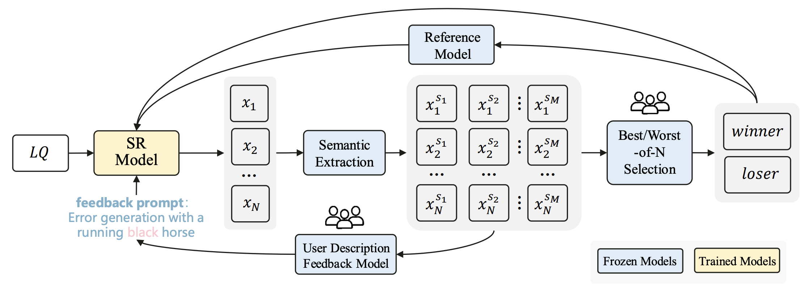
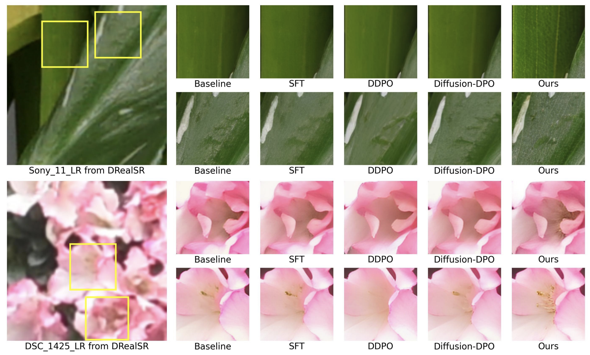

# DSPO: Direct Semantic Preference Optimization for Real-World Image Super-Resolution

<div>
    Miaomiao Cai<sup>1,†</sup>&emsp;
    Simiao Li<sup>2†</sup>&emsp;
    Wei Li<sup>2*</sup>&emsp;
    Xudong Huang<sup>2</sup>&emsp;
    Hanting Chen<sup>2</sup>&emsp;
    Jie Hu<sup>2</sup>&emsp;
    Yunhe Wang<sup>2*</sup>&emsp;
</div>

<div>
    <sup>1</sup>University of Science and Technology of China, <sup>2</sup>Huawei Noah’s Ark Lab, <br/>
</div>

  <a href="https://arxiv.org/pdf/2504.15176">
    
   </a>

---

> **Abstract:** 
Recent advances in diffusion models have improved Real-World Image Super-Resolution (Real-ISR), but existing methods lack human feedback integration, risking misalignment with human preference and may leading to artifacts, hallucinations and harmful content generation. To this end, we are the first to introduce human preference alignment into Real-ISR, a technique that has been successfully applied in Large Language Models and Text-to-Image tasks to effectively enhance the alignment of generated outputs with human preferences. Specifically, we introduce Direct Preference Optimization (DPO) into Real-ISR to achieve alignment, where DPO serves as a general alignment technique that directly learns from the human preference dataset. Nevertheless, unlike high-level tasks, the pixel-level reconstruction objectives of Real-ISR are difficult to reconcile with the image-level preferences of DPO, which can lead to the DPO being overly sensitive to local anomalies, leading to reduced generation quality. To resolve this dichotomy, we propose Direct Semantic Preference Optimization (DSPO) to align instance-level human preferences by incorporating semantic guidance, which is through two strategies: (a) semantic instance alignment strategy, implementing instance-level alignment to ensure fine-grained perceptual consistency, and (b) user description feedback strategy, mitigating hallucinations through semantic textual feedback on instance-level images. As a plug-and-play solution, DSPO proves highly effective in both one-step and multi-step SR frameworks.



## ⚒️ TODO

* [ ] Release code and pretrained models
-

## Results

<details>
<summary>Quantitative Comparisons (click to expand)</summary>

<p align="center">
  
  
</p>
</details>

<details>
<summary>Visual Comparisons (click to expand)</summary>

<p align="center">
  
</p>
</details>


## Citation

If DSPO helps your research or work, please consider citing the following works:

----------
```BibTex
@article{cai2025dspo,
  title={DSPO: Direct Semantic Preference Optimization for Real-World Image Super-Resolution},
  author={Cai, Miaomiao and Li, Simiao and Li, Wei and Huang, Xudong and Chen, Hanting and Hu, Jie and Wang, Yunhe},
  journal={arXiv preprint arXiv:2504.15176},
  year={2025}
}
```
